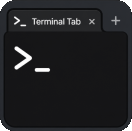

# Terminal Tab

Open a Terminal Tab in the VS Code editor area with a single shortcut.

---

## Author

**Manuel Palanco Correa**  
GitHub: [https://github.com/Trystan4861](https://github.com/Trystan4861)

Repository:  
[https://github.com/Trystan4861/Terminal-Tab.git](https://github.com/Trystan4861/Terminal-Tab.git)

Spanish documentation: [README_ES.md](README_ES.md)

---

## Features

- Opens a terminal tab in the editor area and executes the configured command
- Configurable command (default: `whoami`)
- Command Palette action to change the command
- Command Palette action to open the command setting directly
- Status bar tooltip shows the current configured command
- Reuses existing terminal if already open
- Default shortcut: `Cmd+F1` (macOS) / `Ctrl+F1` (Windows/Linux)

## Usage

Press `Cmd+F1` (macOS) or `Ctrl+F1` (Windows/Linux) to open a terminal tab in the editor area, or run the command **Terminal Tab: Open Terminal** from the Command Palette.
